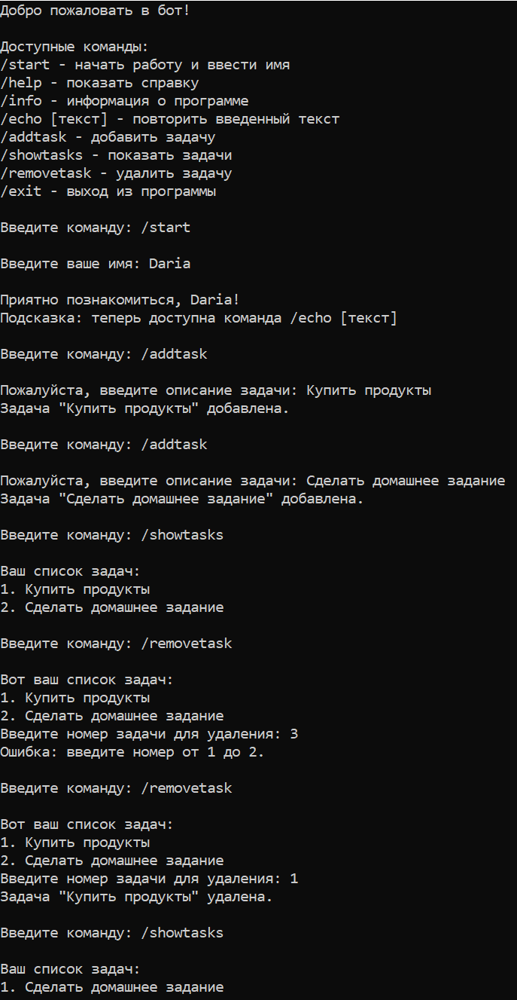

# 🤖 Консольный бот с управлением задачами

## 📋 Описание проекта
Консольное приложение-бот с возможностью управления списком задач.  
Разработано в рамках домашнего задания №2: расширение функционала бота с помощью структуры данных `List<string>`.

## ✨ Новые возможности
- ✅ Добавление задач (`/addtask`)
- ✅ Просмотр списка задач (`/showtasks`)
- ✅ Удаление задач по номеру (`/removetask`)
- ✅ Обработка ошибок при пустом списке и неверном номере

## 🎮 Доступные команды

| Команда | Описание |
|---------|----------|
| `/start` | Начать работу и ввести имя |
| `/help` | Показать справочную информацию |
| `/info` | Информация о программе |
| `/echo [текст]` | Повторить введенный текст |
| `/addtask` | Добавить новую задачу |
| `/showtasks` | Показать список всех задач |
| `/removetask` | Удалить задачу по номеру |
| `/exit` | Выход из программы |

## 📸 Демонстрация работы

## ✅ Критерии выполнения
- `/addtask` — добавление задач
- `/showtasks` — отображение списка
- `/removetask` — удаление по номеру
- Обновленный `/help`
- Обработка ошибок

## ⏱️ Время выполнения
Задание выполнено за 3 часа.

## 👤 Автор
Дорофеева Дарья  
Дата: 24.03.2026

## 📄 Лицензия
MIT License